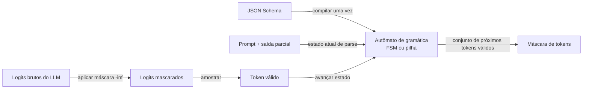

## Definição

**Constrained decoding** é a técnica de modificar a distribuição de logits a cada etapa de decode de forma que o modelo só possa emitir tokens que mantenham a saída em um estado de parse válido. Em vez de amostrar livremente do vocabulário completo, o decoder consulta um **autômato de gramática** que mascara todos os tokens que violariam o esquema alvo — JSON, SQL, regex ou qualquer gramática livre de contexto — antes de amostrar.

O resultado é uma garantia rígida: a saída do modelo é sempre uma instância sintaticamente válida do esquema especificado. Isso é mais forte que as abordagens baseadas em prompt ("por favor, produza JSON") que são apenas indicativas e podem ser violadas pelo modelo.

Duas classes de autômatos são usadas:
- **Máquinas de estados finitos (FSMs)**: Compiladas a partir de expressões regulares ou esquemas simples. Cada token avança o estado da FSM; tokens inválidos são mascarados. Rápidas para compilar e executar em esquemas simples. O Outlines foi pioneiro nessa abordagem.
- **Gramáticas livres de contexto (CFGs)**: Suportam aninhamento arbitrário (ex: objetos JSON aninhados). Requerem autômatos de pilha, que são mais complexos. XGrammar e llguidance implementam constrained decoding baseado em CFG a velocidade próxima de FSM.

## Como funciona

### Custo de compilação e execução

A compilação do esquema é um custo único: um dado JSON Schema é compilado para um autômato uma vez e armazenado em cache. A execução por token — verificar quais tokens são válidos — é o caminho crítico. O Outlines atinge busca de token O(1) via um índice pré-computado. O XGrammar atinge desempenho equivalente ou melhor com expressividade CFG completa através de execução persistente independente de contexto e cache adaptativo de máscara de tokens.

## Comparação de engines

| Engine | Tipo de autômato | Velocidade de compilação | Overhead por token | Notas |
|---|---|---|---|---|
| Outlines | FSM (baseado em índice) | Lento para esquemas complexos (40s–10+ min) | O(1) por token | Pioneiro na abordagem; com dificuldades em esquemas complexos |
| XGrammar | CFG (pilha + otimizações) | Rápido | &lt;40 µs por token | Backend padrão para vLLM, SGLang, TensorRT-LLM (março 2026) |
| llguidance | CFG (Microsoft) | Rápido | Baixo | Usado na biblioteca Guidance |
| llama.cpp GBNF | Gramática BNF | Moderado | Baixo | Suporte a gramática integrado para llama.cpp |
| Modo JSON do provedor | Lado do servidor (não divulgado) | N/A | Zero no lado do cliente | OpenAI, Anthropic, Google; sem garantia de validação de esquema |

## Quando usar / Quando NÃO usar

| Cenário | Usar constrained decoding | Usar alternativas |
|---|---|---|
| Conformidade de esquema determinística necessária | Sim — garantia rígida, não indicativa | Não — modo JSON baseado em prompt pode falhar imprevisivelmente |
| JSON aninhado complexo com esquema profundamente recursivo | Sim — XGrammar lida com CFGs | Não — Outlines pode expirar na compilação |
| JSON simples e plano ou saída regex | Sim — qualquer engine; Outlines ou XGrammar funcionam | Talvez — modo JSON do provedor é mais simples e suficiente |
| Geração criativa de forma livre | Não — restrições de gramática destroem a naturalidade | Sim — amostragem sem restrições |
| API de baixa latência (orçamento abaixo de 100ms) | Sim — XGrammar adiciona &lt;50 µs por token | Não — Outlines com esquemas complexos pode estourar o orçamento de latência no tempo de compilação |

## Fontes

- [GitHub do Outlines](https://github.com/dottxt-ai/outlines) — biblioteca original de constrained decoding baseado em FSM
- [Paper XGrammar](https://arxiv.org/abs/2411.15100) — engine CFG com overhead próximo de zero por token; padrão do vLLM
- [Willard & Louf 2023](https://arxiv.org/abs/2307.09702) — fundação teórica para geração guiada eficiente baseada em FSM
- [Blog de decodificação estruturada do vLLM](https://blog.vllm.ai/2025/01/14/struct-decode-intro.html) — evolução do backend de geração estruturada do vLLM
- [JSONSchemaBench](https://github.com/guidance-ai/jsonschemabench) — benchmark comparando taxas de conformidade entre engines de constrained decoding

## Veja também

- [Geração estruturada](/docs/structured-generation)
- [Instructor e modo JSON](/docs/structured-generation/instructor-and-json-mode)
- [Otimização de inferência](/docs/inference-optimization)
- [vLLM](/docs/inference-optimization/vllm)
- [Engenharia de prompt](/docs/prompt-engineering)
