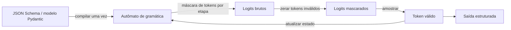

## Definição

**Geração estruturada** é a família de técnicas que restringem a saída de um modelo de linguagem para estar em conformidade com um esquema ou gramática predefinida — produzindo JSON, XML, SQL ou qualquer gramática livre de contexto válidos, em vez de texto livre. Isso transforma LLMs de geradores de texto imprevisíveis em componentes de software confiáveis cujas saídas podem ser analisadas deterministicamente.

Sem geração estruturada, extrair dados estruturados da saída de LLM requer parsing frágil com regex ou loops de retry. Com ela, o modelo é matematicamente garantido a emitir tokens que formam uma estrutura válida — ao custo de alguma flexibilidade e, dependendo do método, latência adicional.

Existem duas abordagens principais:
- **Mascaramento de tokens (baseado em FSM)**: Uma máquina de estados finitos (FSM) compilada a partir do esquema mascara os logits a cada etapa de decode, zerando tokens que produziriam saída inválida. O Outlines foi pioneiro nessa abordagem; o XGrammar a estende com suporte completo a gramáticas livres de contexto.
- **Modo JSON em nível de API**: Provedores (OpenAI, Anthropic, Google) impõem saída estruturada no lado do servidor. O modelo é instruído por prompt ou fine-tuned para preferir saída estruturada e o servidor valida/tenta novamente internamente.

A partir de 2025–2026, o **XGrammar** é o backend padrão de geração estruturada para vLLM, SGLang e TensorRT-LLM, atingindo menos de 40 microssegundos de overhead por token — efetivamente geração estruturada de custo zero em tempo de serving.

## Como funciona

A cada etapa de decode, o autômato de gramática inspeciona o estado atual de parse e computa o conjunto de tokens que mantêm a saída válida. Os logits desses tokens são mantidos; todos os outros são definidos como `-inf`. A amostragem então extrai apenas de continuações válidas. A compilação do esquema é um custo único amortizado em todas as requisições que compartilham o esquema.

## Quando usar / Quando NÃO usar

| Cenário | Usar | Evitar |
|---|---|---|
| Extraindo dados estruturados para código downstream | Sim — elimina parsing frágil de texto | Não — adiciona complexidade para geração única |
| Chamada de função/ferramenta com parâmetros tipados | Sim — combina bem com tool use do OpenAI/Anthropic | Não — se o provedor já lida com validação de esquema |
| Saída criativa ou conversacional longa e livre | Não — restrições de gramática destroem a naturalidade | Sim — geração sem restrições é a ferramenta certa |
| Apps multi-provedor (precisam do mesmo esquema em todos) | Sim — Instructor abstrai as diferenças entre provedores | Não — se você só tem como alvo o modo JSON nativo de um provedor |
| Serving de produção sensível à latência | Sim — XGrammar adiciona &lt;50 µs por token no vLLM | Não — Outlines com esquemas complexos pode compilar por minutos |

## Conceitos-chave

| Conceito | Descrição |
|---|---|
| Mascaramento de tokens | Definir logits de tokens inválidos como `-inf` a cada etapa de decode |
| FSM (máquina de estados finitos) | Autômato compilado a partir de uma regex ou esquema simples |
| CFG (gramática livre de contexto) | Mais expressiva que FSM; suporta estruturas aninhadas como JSON |
| Outlines | Biblioteca Python pioneira no constrained decoding baseado em FSM |
| XGrammar | Engine CFG atingindo velocidade de FSM; backend padrão para vLLM |
| Instructor | Biblioteca Python que envolve qualquer LLM com saída estruturada validada por Pydantic e retry automático |
| Modo JSON | Imposição no lado do provedor de que a saída é JSON válido (sem validação de esquema) |

## Fontes

- [Outlines — geração de texto estruturado](https://github.com/dottxt-ai/outlines) — biblioteca original de constrained decoding baseado em FSM
- [Paper XGrammar](https://arxiv.org/abs/2411.15100) — engine baseado em CFG com overhead próximo de zero; padrão do vLLM desde início de 2025
- [Documentação do Instructor](https://python.useinstructor.com/) — saída estruturada baseada em Pydantic com suporte multi-provedor e lógica de retry
- [Blog de decodificação estruturada do vLLM](https://blog.vllm.ai/2025/01/14/struct-decode-intro.html) — integração do vLLM de geração constrangida por gramática
- [Deep dive em constrained decoding — Let's Data Science](https://letsdatascience.com/blog/structured-outputs-making-llms-return-reliable-json) — guia prático sobre como saídas estruturadas funcionam por dentro

## Veja também

- [Constrained decoding](/docs/structured-generation/constrained-decoding)
- [Instructor e modo JSON](/docs/structured-generation/instructor-and-json-mode)
- [Engenharia de prompt](/docs/prompt-engineering)
- [Otimização de inferência](/docs/inference-optimization)
- [RAG](/docs/rag)
