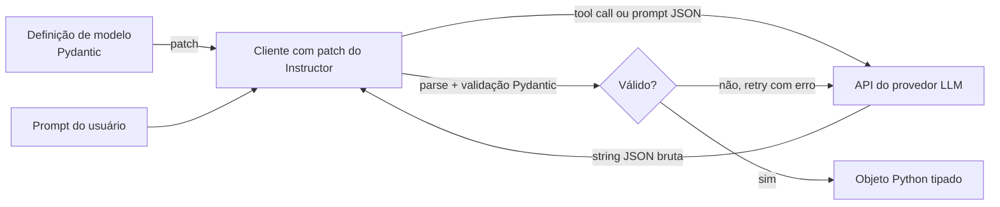

## Definição

**Instructor** é uma biblioteca Python que envolve qualquer provedor LLM (OpenAI, Anthropic, Google, Cohere e outros) com capacidades de saída estruturada baseadas em modelos Pydantic. Você define sua saída desejada como uma classe Pydantic, passa para o Instructor e recebe um objeto Python validado — não uma string bruta. Se o modelo produz saída que falha na validação do Pydantic, o Instructor automaticamente tenta novamente com o erro de validação como feedback.

**Modo JSON** é um recurso mais leve no lado do servidor oferecido pela maioria dos principais provedores LLM (OpenAI `response_format: \{"type": "json_object"\}`, Anthropic tool use com JSON schema, Google `response_mime_type: "application/json"`). O modo JSON garante que a saída seja JSON válido — mas diferente do constrained decoding baseado em esquema, não garante que o JSON esteja em conformidade com um esquema específico. Previne erros de parse, mas não impõe tipos de campos ou chaves obrigatórias.

A escolha prática:
- Use **Instructor** quando precisar de saída type-safe e validada por esquema com loops de feedback de validação e portabilidade multi-provedor.
- Use **modo JSON do provedor** quando quiser zero dependências adicionais, JSON simples e plano, e estiver disposto a lidar com validação de esquema no seu próprio código.
- Use **constrained decoding** (Outlines, XGrammar) quando estiver executando seu próprio servidor de inferência e precisar de garantias rígidas de esquema em nível de token.

## Como funciona



O Instructor aplica patch no cliente do provedor para injetar o esquema Pydantic como uma definição de ferramenta (para provedores que suportam tool use) ou como um JSON schema no prompt do sistema. Quando a validação falha, a mensagem de erro é adicionada à conversa e o modelo é instruído a corrigir sua saída, até um limite configurável de `max_retries`.

## Comparação Instructor vs. modo JSON

| Funcionalidade | Instructor | Modo JSON do provedor |
|---|---|---|
| JSON válido garantido | Sim | Sim |
| Validação de esquema | Sim — Pydantic imposto | Não — você valida manualmente |
| Retry automático em saída inválida | Sim — com feedback de validação | Não |
| Suporte multi-provedor | Sim — mesmo modelo Pydantic entre provedores | Não — formato específico do provedor |
| Suporte a streaming | Sim — streaming de objeto parcial | Dependente do provedor |
| Dependência | `pip install instructor` | Zero (parâmetro de API integrado) |
| Esquemas aninhados / complexos | Sim | Arriscado — o modelo pode violar a estrutura |

## Exemplo de código

```python
import instructor
from anthropic import Anthropic
from pydantic import BaseModel

class Article(BaseModel):
    title: str
    summary: str
    tags: list[str]
    sentiment: str  # "positive" | "neutral" | "negative"

client = instructor.from_anthropic(Anthropic())

article = client.messages.create(
    model="claude-opus-4-5",
    max_tokens=512,
    messages=[{
        "role": "user",
        "content": "Extract structured info from this text: 'vLLM 0.6 ships XGrammar as default backend, improving structured output speed by 100x.'"
    }],
    response_model=Article,
)

print(article.title)   # str validado
print(article.tags)    # list[str] validado
```

## Quando usar / Quando NÃO usar

| Cenário | Usar Instructor | Usar alternativa |
|---|---|---|
| App multi-provedor (OpenAI + Anthropic + local) | Sim — um modelo Pydantic funciona em todos os lugares | Não — modo JSON específico do provedor requer tratamento separado |
| Extração aninhada complexa (entidades, relações) | Sim — Pydantic lida com modelos aninhados e validadores | Não — modo JSON não vai impor esquema aninhado |
| Extração JSON rápida e única | Talvez — Instructor adiciona uma dependência | Sim — modo JSON simples + parse manual é suficiente |
| Executando seu próprio servidor de inferência | Não — use constrained decoding em nível de token | Sim — XGrammar / Outlines dão garantias rígidas |
| Saída estruturada em streaming | Sim — Instructor suporta streaming parcial via `create_partial` | Dependente do provedor |

## Fontes

- [Documentação do Instructor](https://python.useinstructor.com/) — referência completa da API e guias de integração multi-provedor
- [GitHub do Instructor](https://github.com/instructor-ai/instructor) — biblioteca open-source com exemplos
- [Guia de saídas estruturadas da OpenAI](https://platform.openai.com/docs/guides/structured-outputs) — modo JSON e formato de resposta constrangido por esquema da OpenAI
- [Tool use da Anthropic para saída estruturada](https://docs.anthropic.com/en/docs/tool-use) — usando definições de ferramentas para extrair dados estruturados com Claude

## Veja também

- [Geração estruturada](/docs/structured-generation)
- [Constrained decoding](/docs/structured-generation/constrained-decoding)
- [Engenharia de prompt](/docs/prompt-engineering)
- [Tool use da Anthropic](/docs/agents/anthropic-tool-use)
