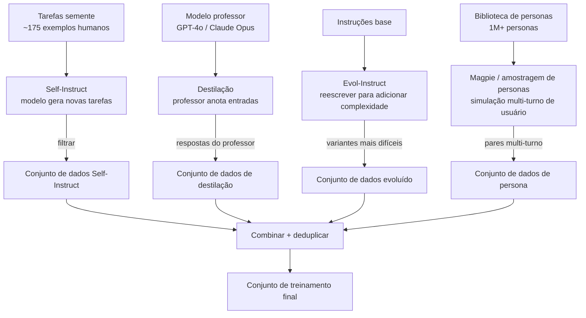

## Definição

Métodos de geração de dados sintéticos definem *como* um modelo gerador é solicitado a produzir pares de instrução-resposta. A escolha do método determina a diversidade, a distribuição de dificuldade e a cobertura de domínio do conjunto de dados resultante. Nenhum método domina todos os cenários; os praticantes tipicamente combinam abordagens.

O campo pode ser organizado em quatro famílias:
1. **Self-Instruct** — bootstrapping a partir de um pequeno conjunto semente, solicitando ao modelo que gere novas instruções de tarefa.
2. **Destilação de conhecimento** — um modelo professor poderoso gera respostas que um modelo estudante menor é treinado a imitar.
3. **Evol-Instruct / evolução** — reescrita iterativa de instruções existentes para torná-las mais difíceis, complexas ou diversas.
4. **Persona / simulação de usuário** — geração de dados a partir de personas de usuário simuladas para melhorar a diversidade e reduzir a homogeneidade.

## Como funciona

### Self-Instruct

Proposto por Wang et al. (2023), o Self-Instruct começa com aproximadamente 175 tarefas semente escritas manualmente e solicita ao modelo gerador que produza novas descrições de tarefas e os pares de entrada-saída correspondentes. Um filtro heurístico remove instruções de baixa qualidade e quase duplicadas (similaridade ROUGE-L > 0,7 é um limiar de deduplicação comum). O processo itera: tarefas recém-geradas são adicionadas ao pool e usadas como sementes para a próxima rodada.

O Self-Instruct tem baixo custo e requer esforço humano mínimo, mas tende a favorecer tipos de tarefa mais fáceis e comuns. **CoT-Self-Instruct** estende o método ao instruir o modelo a raciocinar via chain-of-thought antes de gerar a tarefa e a resposta, melhorando a cobertura de exemplos com raciocínio intensivo.

### Destilação de conhecimento via dados sintéticos

O modelo professor (ex.: GPT-4o, Claude Opus) recebe prompts de entrada reais e gera respostas de alta qualidade. O modelo estudante (ex.: Phi-4, Mistral 7B) é ajustado fino para imitar essas respostas via perda de entropia cruzada padrão. Essa abordagem alimenta muitos modelos de peso aberto: o Phi-4 (Microsoft) usou 80% de dados sintéticos do GPT-4, alcançando desempenho próximo ao GPT-4 com 14B parâmetros.

Uma variante — **auto-destilação simples (SSD)** — amostra soluções do próprio modelo base em temperatura elevada, depois faz ajuste fino nos samples brutos não verificados. A SSD melhora a geração de código sem exigir um professor externo.

### Evol-Instruct

O Evol-Instruct (WizardLM, 2023) pega instruções existentes e as reescreve para torná-las mais difíceis, longas, mais restringidas ou mais abstratas usando um conjunto fixo de prompts de evolução:
- **Evolução em amplitude:** gerar uma nova tarefa diferente do mesmo domínio.
- **Evolução em profundidade:** adicionar restrições, casos extremos ou passos de raciocínio.
- **Filtro de degeneração:** descartar instruções que o gerador não consegue responder.

WizardCoder e WizardMath aplicaram o Evol-Instruct a conjuntos de dados de código e matemática, produzindo conjuntos de treinamento que superaram anotações humanas brutas no HumanEval e GSM8K.

### Magpie e geração baseada em persona

O Magpie (2024) explora o alinhamento de seguimento de instruções de modelos de chat: ao solicitar ao modelo apenas o prefixo do turno do usuário sem prompt de sistema, o modelo gera consultas de usuário realistas que refletem padrões de uso reais sem nenhum conjunto de tarefas semente. Combinado com uma biblioteca de personas (mais de 1M personas demograficamente diversas), o Magpie pode gerar conversas multi-turno altamente diversas.

A geração baseada em persona é particularmente eficaz para reduzir o viés de homogeneidade do Self-Instruct, que tende a produzir dados a partir de uma perspectiva implícita de usuário padrão.

## Quando usar / Quando NÃO usar

| Método | Usar quando | Evitar quando |
|---|---|---|
| Self-Instruct | Orçamento baixo, sem acesso a modelo professor, tarefas gerais | Domínio requer precisão factual; alucinação própria se propaga |
| Destilação | Acesso a um professor poderoso; alvo de estudante pequeno | Professor é caro e o conjunto de dados é grande (custo proibitivo) |
| Evol-Instruct | Precisa de exemplos difíceis e diversos para uma habilidade específica | Conjunto de instruções base já é de alta qualidade e diverso |
| Magpie / persona | Precisa de distribuição realista de consultas de usuário; reduzindo homogeneidade | Domínio requer conhecimento especialista além dos priors do modelo |

## Fontes

- [Self-Instruct: aligning language models with self-generated instructions — arXiv 2212.10560](https://arxiv.org/abs/2212.10560)
- [WizardLM: empowering large language models to follow complex instructions — arXiv 2304.12244](https://arxiv.org/abs/2304.12244)
- [Embarrassingly simple self-distillation improves code generation — arXiv 2604.01193](https://arxiv.org/html/2604.01193v1)
- [How to generate synthetic training data for LLM fine-tuning — PremAI](https://blog.premai.io/how-to-generate-synthetic-training-data-for-llm-fine-tuning-2026-guide/)
- [NVIDIA — synthetic data pipelines for AI model distillation](https://developer.nvidia.com/blog/how-to-build-license-compliant-synthetic-data-pipelines-for-ai-model-distillation/)

## Veja também

- [Dados sintéticos](/docs/synthetic-data)
- [Filtragem de qualidade](/docs/synthetic-data/quality-filtering)
- [Ajuste fino de LLMs](/docs/llms/fine-tuning)
- [Destilação de conhecimento](/docs/knowledge-distillation)
