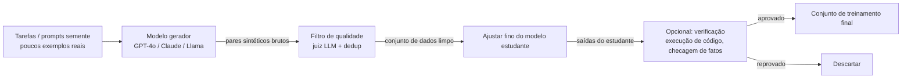

## Definição

**Dados sintéticos** são dados de treinamento gerados por máquina sem coleta de observações do mundo real. No contexto de modelos de linguagem de grande escala, dados sintéticos são tipicamente gerados por um modelo professor ou oráculo — GPT-4, Claude ou um especialista de domínio — e usados para treinar um modelo estudante menor ou mais especializado. O objetivo é substituir a anotação humana cara, contornar restrições de licenciamento de dados e controlar a distribuição do conjunto de treinamento.

Dados sintéticos tornaram-se uma técnica central no desenvolvimento moderno de LLMs. Modelos como Phi-4 (Microsoft), Llama-3 (Meta) e Mistral dependem fortemente de dados de instrução sintéticos. O mercado de geração de dados sintéticos está projetado para atingir $3,5 bilhões até 2026, impulsionado pelos avanços em LLMs e pela demanda por destilação de modelos.

Três desafios definem o campo:
1. **Diversidade** — geradores sintéticos tendem a produzir padrões repetitivos; a cobertura de casos raros requer augmentação deliberada.
2. **Precisão** — modelos alucinam; dados gerados devem ser verificados para evitar treinamento em fatos falsos.
3. **Colapso de modelo** — treinar iterativamente em dados gerados por modelos sem injeção de dados reais causa degradação de qualidade ao longo de gerações sucessivas.

Esta seção aborda:
- **[Métodos de geração](/docs/synthetic-data/generation-methods)** — Self-Instruct, Evol-Instruct, destilação, Magpie e abordagens baseadas em persona.
- **[Filtragem de qualidade](/docs/synthetic-data/quality-filtering)** — LLM como juiz, pontuação por modelo de recompensa, deduplicação e verificações de segurança.

## Como funciona

## Quando usar / Quando NÃO usar

| Cenário | Usar dados sintéticos | Evitar |
|---|---|---|
| Dados rotulados limitados para um domínio especializado | Sim — gerar exemplos direcionados com um modelo professor | Não — se dados reais de alta qualidade existem em abundância |
| Restrições de privacidade de dados (saúde, finanças) | Sim — sintético evita exposição de PII | Não — verificar que dados sintéticos não podem ser rastreados de volta a registros reais |
| Augmentação de exemplos de classes raras | Sim — geração controlável cobre a cauda | Não — se o modelo base não tem conhecimento do domínio |
| Treinamento de um modelo destilado menor | Sim — destilação de conhecimento via dados sintéticos é padrão | Não — para tarefas que requerem embasamento factual (use dados reais) |
| Avaliação de capacidades do modelo | Sim — evals sintéticas permitem dificuldade controlada | Não — evals finais de preferência humana ainda precisam de anotadores reais |

## Fontes

- [How to generate synthetic training data for LLM fine-tuning — PremAI](https://blog.premai.io/how-to-generate-synthetic-training-data-for-llm-fine-tuning-2026-guide/)
- [Synthetic data: a secret ingredient for better language models — Red Hat](https://www.redhat.com/en/blog/synthetic-data-secret-ingredient-better-language-models)
- [The definitive guide to synthetic data generation using LLMs — Confident AI](https://www.confident-ai.com/blog/the-definitive-guide-to-synthetic-data-generation-using-llms)
- [NVIDIA — how to build license-compliant synthetic data pipelines](https://developer.nvidia.com/blog/how-to-build-license-compliant-synthetic-data-pipelines-for-ai-model-distillation/)

## Veja também

- [Métodos de geração](/docs/synthetic-data/generation-methods)
- [Filtragem de qualidade](/docs/synthetic-data/quality-filtering)
- [Ajuste fino de LLMs](/docs/llms/fine-tuning)
- [Destilação de conhecimento](/docs/knowledge-distillation)
- [Métricas de avaliação](/docs/evaluation-metrics)
