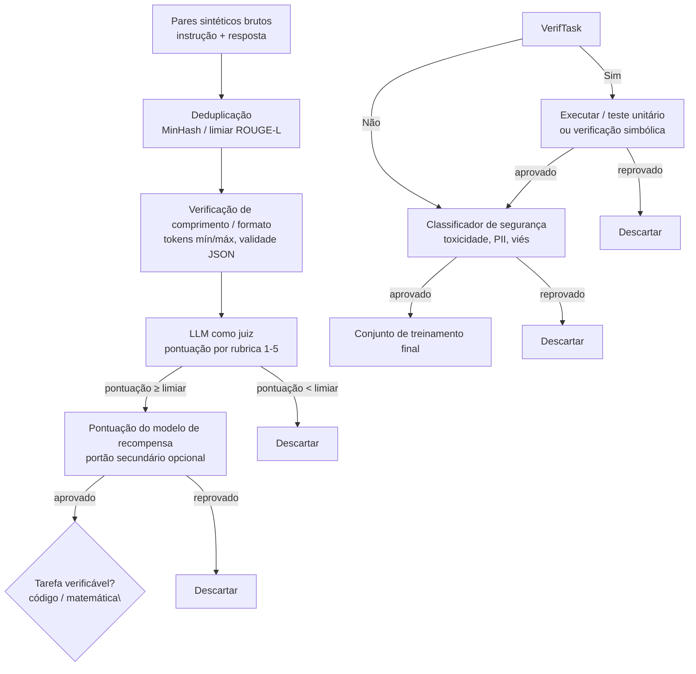

## Definição

**Filtragem de qualidade** é o conjunto de etapas pós-geração aplicadas a dados sintéticos brutos para remover exemplos de baixa qualidade, duplicados, nocivos ou factualmente incorretos antes que entrem no conjunto de treinamento. Sem filtragem, modelos treinados em dados sintéticos sofrem de ruído composto: erros e alucinações no gerador se propagam para o estudante, e o auto-treinamento iterativo sem filtragem leva ao **colapso de modelo** — uma degradação de qualidade ao longo de gerações sucessivas de treinamento.

A filtragem opera em dois estágios: (1) imediatamente após a geração de contexto/instrução, para capturar saídas de baixa coerência ou fora do tópico, e (2) após a geração de respostas, para avaliar a qualidade da resposta antes de incluir o par no conjunto de dados final.

## Como funciona

### Deduplicação

Instruções quase duplicadas produzem atualizações de gradiente redundantes e inflam a diversidade aparente do conjunto de dados. MinHash LSH (Locality Sensitive Hashing) identifica eficientemente quase-duplicatas em milhões de exemplos. Um limiar de similaridade ROUGE-L de 0,7 é um cutoff de deduplicação comum para texto de instrução; limiares mais rígidos (0,5) são aplicados para texto de resposta em conjuntos de dados de destilação onde a repetição é especialmente nociva.

### LLM como juiz

Um avaliador LLM pontua exemplos sintéticos em uma rubrica — tipicamente cobrindo completude, correção, clareza e seguimento de instrução — em uma escala de 1 a 5. Pares com pontuação abaixo de um limiar (ex.: 3 de 5) são descartados. O modelo juiz deve ser igual ou mais forte do que o gerador; usar o mesmo modelo como juiz e gerador introduz viés de auto-avaliação.

**Prometheus** e **GPT-4 como juiz** são modelos juízes populares de código aberto e fechado, respectivamente. Pesquisas mostram que juízes LLM alcançam 80–90% de concordância com anotadores humanos na qualidade de seguimento de instrução, tornando-os economicamente eficientes em escala.

### Pontuação por modelo de recompensa

Um modelo de recompensa (RM) treinado em dados de preferência humana fornece um sinal de qualidade que generaliza além de uma rubrica. RMs de pipelines de RLHF (ex.: Llama Reward, OpenAssistant RM) pontuam respostas; exemplos com pontuações RM abaixo da mediana do conjunto de dados são filtrados. A filtragem por RM é particularmente eficaz em capturar respostas verbosas, bajuladoras ou de baixa informação que juízes LLM às vezes perdem.

### Validação de tarefas verificáveis

Para código e matemática, a correção pode ser verificada programaticamente:
- **Código:** executar o código gerado contra testes unitários; descartar exemplos que falham.
- **Matemática:** aplicar um solucionador simbólico (SymPy) ou verificador formal para checar a resposta; descartar derivações incorretas.

A filtragem verificável é o sinal de qualidade mais forte disponível — um teste unitário com falha é um marcador de qualidade inequívoco. Modelos treinados apenas em exemplos de código verificavelmente corretos (OSS-Instruct, Magicoder) consistentemente superam aqueles treinados em código não verificado.

### Filtragem de segurança

Um classificador de segurança verifica conteúdo nocivo (toxicidade, discurso de ódio, automutilação), vazamento de PII (nomes, e-mails, números de telefone em exemplos derivados de dados reais) e violações de políticas. Classificadores prontos para uso (Perspective API, Azure Content Safety, Meta LlamaGuard) são tipicamente usados como portão final antes que o conjunto de dados seja confirmado.

## Quando usar / Quando NÃO usar

| Filtro | Sempre aplicar | Ignorar |
|---|---|---|
| Deduplicação | Sim — sempre | Nunca — duplicatas prejudicam a generalização |
| LLM como juiz | Sim para conjuntos de dados de seguimento de instrução | Opcional para tarefas verificáveis (usar execução em vez disso) |
| Modelo de recompensa | Para conjuntos de dados de RLHF / ajuste fino por preferência | Desnecessário para SFT simples se o limiar do juiz é estrito |
| Execução verificável | Sim para código e matemática | N/A para tarefas de geração aberta |
| Classificador de segurança | Sim para qualquer implantação pública ou voltada ao usuário | Conjuntos de dados de pesquisa interna podem relaxar isso |

## Trade-offs de intensidade de filtragem

| Limiar | Dados retidos | Qualidade | Risco |
|---|---|---|---|
| Leniente (juiz ≥ 2/5) | 90% | Ruidoso — inclui exemplos mediocres | Maior risco de colapso de modelo |
| Moderado (juiz ≥ 3/5) | 60–70% | Bom equilíbrio | Prática padrão |
| Estrito (juiz ≥ 4/5) | 20–40% | Alta qualidade | Pode sub-representar casos difíceis |

## Fontes

- [The definitive guide to synthetic data generation using LLMs — Confident AI](https://www.confident-ai.com/blog/the-definitive-guide-to-synthetic-data-generation-using-llms)
- [CoT-Self-Instruct: building high-quality synthetic prompts — OpenReview](https://openreview.net/forum?id=nPEWyL8kxO)
- [Self-training AI: how synthetic data powers the next generation of LLMs — Contineo](https://contineo.world/self-training-ai-how-synthetic-data-is-powering-the-next-generation-of-llms/)
- [ACL 2025 tutorial on synthetic data](https://synth-data-acl.github.io/static/slides/slides.pdf)

## Veja também

- [Dados sintéticos](/docs/synthetic-data)
- [Métodos de geração](/docs/synthetic-data/generation-methods)
- [Métricas de avaliação](/docs/evaluation-metrics)
- [Pós-treinamento de LLMs](/docs/llms/post-training)
- [Viés em IA](/docs/bias-in-ai)
