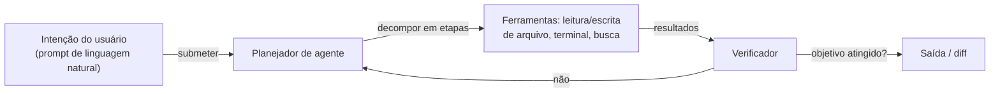

## Definição

Antigravity é um ambiente de desenvolvimento integrado orientado a agentes projetado para **vibe coding** — uma abordagem onde você descreve intenções em linguagem natural e o agente de IA escreve, refatora e executa código de forma autônoma para alcançar o objetivo. Em vez de completar linha por linha, o Antigravity opera em loops de tarefa completos: lê sua base de código, planeja alterações, as aplica e verifica os resultados.

O editor foi desenvolvido para baixar a fricção entre ideia e código funcionando ao máximo. As instruções de agentes (semelhantes ao `CLAUDE.md` do [Claude Code](/docs/tools/claude-code)) permitem que você defina regras persistentes sobre estilo de código, stack tecnológica e restrições de segurança. O Antigravity pode encadear múltiplas ações de ferramenta — leitura de arquivo, escrita, execução de terminal, pesquisa na web — para completar metas que de outra forma exigiriam múltiplas etapas manuais.

## Funcionamento

### Instruções de agente

Instruções de agente persistentes (arquivo `.agentrc` ou painel de configurações) fornecem ao agente contexto sobre sua base de código: arquitetura preferida, convenções de nomenclatura, quais arquivos nunca modificar e como executar testes. Isso substitui a necessidade de re-especificar contexto a cada sessão.

### Loops de tarefa

O agente itera — lê saída, ajusta plano, executa novamente — até que a condição de conclusão seja atendida (testes passando, linter limpo, endpoint respondendo). Você pode observar, pausar e redirecionar a qualquer momento.

## Quando usar / Quando NÃO usar

| Cenário | Usar Antigravity | NÃO usar Antigravity |
|---------|-----------------|---------------------|
| Prototipagem rápida de um recurso do zero | Sim — ideal para vibe coding orientado a intenção | |
| Refatoração de código legado com testes | Sim — o agente pode aplicar e verificar alterações em loop | |
| Exploração de uma base de código não familiar | Sim — o agente lê e explica antes de agir | |
| Revisão detalhada de segurança de código crítico | | Prefira revisão manual ou ferramentas de auditoria especializadas |
| Quando você quer aprender escrevendo código | | A execução autônoma pode contornar o aprendizado |

## Vantagens e desvantagens

| Vantagens | Desvantagens |
|---------|------------|
| Entrada em linguagem natural reduz contexto mental | Iteração autônoma pode inserir bugs silenciosamente |
| Instruções persistentes eliminam repetição de contexto | Menos controle granular do que edição linha por linha |
| Loop completo de tarefa reduz troca de contexto manual | Requer revisão cuidadosa dos diffs gerados |
| Bom para explorar e prototipar rapidamente | Modelo mais novo com ecossistema e plugins limitados |

## Recursos práticos

- [Site oficial do Antigravity](https://antigravity.sh/) — Documentação, download e exemplos

## Veja também

- [Claude Code](/docs/tools/claude-code)
- [Cursor](/docs/tools/cursor)
- [GitHub Copilot](/docs/tools/github-copilot)
- [Kiro](/docs/tools/kiro)
