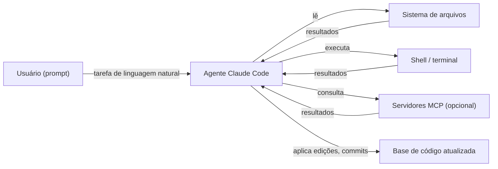

## Definição

Claude Code é o agente de codificação oficial da Anthropic. Ele roda no terminal, integra com IDEs (VS Code, JetBrains) via extensão e tem uma interface web. Você descreve uma tarefa em linguagem natural e o Claude lê arquivos, edita código, executa comandos de shell e faz commit de alterações para completar a tarefa.

O Claude Code usa o modelo Claude da Anthropic e pode operar de forma totalmente autônoma em tarefas longas (modo "sem supervisão") ou em loop com você para revisão de cada alteração. Ele tem suporte de primeira classe para [MCP (Model Context Protocol)](/docs/mcp) — você pode conectar servidores MCP para dar ao Claude acesso a ferramentas externas como bancos de dados, APIs ou ferramentas personalizadas. Arquivos `CLAUDE.md` na raiz do repositório fornecem instruções persistentes específicas do projeto.

## Funcionamento

### CLAUDE.md

Coloque um arquivo `CLAUDE.md` na raiz do seu repositório para fornecer ao Claude instruções persistentes: stack preferida, convenções de código, quais arquivos nunca tocar, como executar testes. O Claude lê isso no início de cada sessão.

### Servidores MCP

Conecte servidores MCP para estender as ferramentas do Claude: banco de dados PostgreSQL, GitHub API, Sentry, ferramentas internas. O Claude pode então consultar esses serviços diretamente durante uma tarefa sem que você precise copiar/colar saída.

### Modos de operação

**Modo interativo** — Claude sugere cada alteração, você aprova. **Modo autônomo** — Claude completa toda a tarefa e você revisa o diff. **Modo headless** — Claude é invocado via script para automação de CI.

## Quando usar / Quando NÃO usar

| Cenário | Usar Claude Code | NÃO usar Claude Code |
|---------|-----------------|---------------------|
| Implementação de um recurso abrangendo múltiplos arquivos | Sim — o agente gerencia o contexto entre arquivos | |
| Refatoração de código legado com testes | Sim — executa testes em loop até ficarem verdes | |
| Configuração de um novo projeto com boilerplate | Sim — escreve arquivos, instala dependências | |
| Completação inline rápida ao digitar | | Prefira GitHub Copilot / Cursor para sugestões em linha |
| Revisão de segurança de código crítico | | A revisão humana permanece essencial |

## Vantagens e desvantagens

| Vantagens | Desvantagens |
|---------|------------|
| Acesso profundo ao sistema de arquivos e shell | Pode fazer alterações destrutivas se não supervisionado |
| Suporte MCP para ferramentas externas ricas | Requer revisão cuidadosa de diffs |
| CLAUDE.md para contexto persistente de projeto | Custo mais alto por tarefa do que modelos menores |
| Operação autônoma para tarefas longas | A velocidade de iteração depende da velocidade da API |

## Recursos práticos

- [Documentação do Claude Code](https://docs.anthropic.com/claude-code) — Guias de início, referência de comandos e integração MCP
- [Extensão VS Code do Claude Code](https://marketplace.visualstudio.com/items?itemName=anthropic.claude-code) — Integração IDE para completação inline e painel de agente

## Veja também

- [MCP](/docs/mcp)
- [Cursor](/docs/tools/cursor)
- [GitHub Copilot](/docs/tools/github-copilot)
- [Kiro](/docs/tools/kiro)
- [Antigravity](/docs/tools/antigravity)
