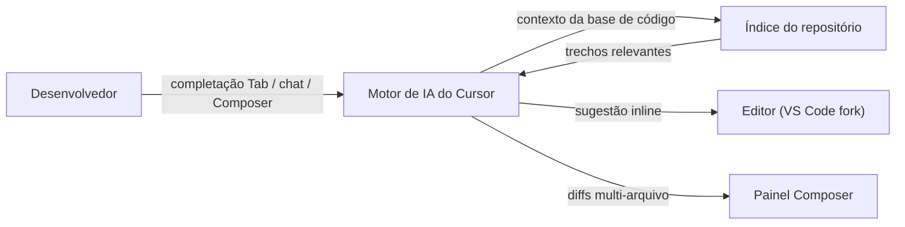

## Definição

Cursor é um editor de código com IA construído sobre VS Code. Ele mantém toda a UX familiar do VS Code — extensões, atalhos de teclado, configurações — e adiciona completação de código com IA, um painel de chat com contexto de base de código e edição multi-arquivo via um modo "Composer" orientado a agentes.

O Cursor indexa seu repositório localmente para que as sugestões de IA tenham contexto da sua base de código real, não apenas do arquivo atual. O modo Composer permite que você descreva uma alteração multi-arquivo em linguagem natural e o Cursor aplica os diffs por você, com um fluxo de revisão integrado. Ele suporta múltiplos modelos de backend (GPT-4o, Claude, Gemini) e pode ser apontado para um endpoint de API personalizado.

## Funcionamento

### Completação Tab

Completação preditiva multilinhas à medida que você digita. O Cursor observa padrões no arquivo atual e em arquivos relacionados e oferece blocos maiores de código do que completações de token único.

### Chat com contexto de base de código

O painel de chat entende símbolos, arquivos e histórico de git. Pergunte "onde esta função é chamada?" ou "explique esta classe" sem copiar código manualmente.

### Composer (modo agente)

Descreva um recurso ou refatoração. O Cursor escreve múltiplos arquivos, mostra um diff unificado e permite aplicar ou rejeitar por bloco.

## Quando usar / Quando NÃO usar

| Cenário | Usar Cursor | NÃO usar Cursor |
|---------|------------|----------------|
| Desenvolvimento diário com completação inteligente | Sim — completação multilinhas e chat de base de código | |
| Refatorações multi-arquivo | Sim — Composer aplica diffs coordenados | |
| Usuários existentes de VS Code | Sim — mesmas extensões e atalhos | |
| Trabalho em constrained/air-gapped networks | | O modelo de IA requer conectividade externa |
| Quando você já prefere outra IDE (JetBrains, Neovim) | | A integração mais profunda está no VS Code |

## Comparações

| Funcionalidade | Cursor | GitHub Copilot |
|---------|--------|----------------|
| Base | Fork do VS Code | Extensão para qualquer IDE |
| Contexto da base de código | Indexação de repositório completo | Arquivo atual + abertos |
| Edição multi-arquivo | Sim (Composer) | Limitado (Copilot Workspace) |
| Modelos de backend | GPT-4o, Claude, Gemini | Principalmente modelos OpenAI/GitHub |
| Preço | Assinatura (gratuito com limites) | Assinatura (gratuito para estudantes/OSS) |

## Vantagens e desvantagens

| Vantagens | Desvantagens |
|---------|------------|
| Compatível com VS Code — sem nova curva de aprendizado | Fork em vez de extensão: actualizações do VS Code atrasam |
| Indexação de repositório para sugestões conscientes de contexto | Dados do repositório enviados para servidores do Cursor |
| Composer simplifica alterações multi-arquivo | Requer assinatura paga para uso completo |
| Suporte a múltiplos modelos de backend | Experiência de completação variável entre modelos |

## Recursos práticos

- [Site oficial do Cursor](https://cursor.sh/) — Download, documentação e changelog
- [Documentação do Cursor](https://docs.cursor.sh/) — Referência de funcionalidades, configuração de modelo e guias de solução de problemas

## Veja também

- [GitHub Copilot](/docs/tools/github-copilot)
- [Claude Code](/docs/tools/claude-code)
- [Kiro](/docs/tools/kiro)
