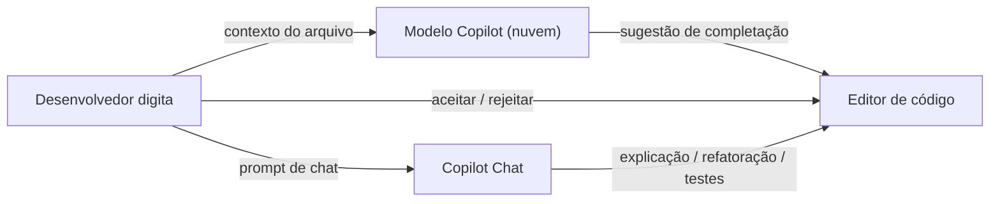

## Definição

GitHub Copilot é um assistente de codificação com IA desenvolvido pela GitHub e OpenAI. Ele se integra diretamente ao seu editor de código (VS Code, JetBrains, Neovim, etc.) e fornece sugestões de código inline em tempo real à medida que você digita, além de recursos de chat para explicação de código, geração de testes e resolução de bugs.

O Copilot usa grandes modelos de linguagem treinados em código público do GitHub. Ele sugere completações baseadas no contexto do arquivo atual, comentários e código aberto em outras abas. O Copilot Chat (disponível no VS Code e GitHub.com) suporta conversas mais longas: explique o que esse código faz, gere testes unitários para esta função, refatore para usar async/await. O Copilot Workspace é um modo experimental mais autônomo semelhante aos sistemas de agentes.

## Funcionamento

### Completação inline

Ao digitar, o Copilot exibe uma sugestão em cinza claro. Pressione Tab para aceitar, Esc para rejeitar, ou Alt+] para ver sugestões alternativas. Funciona em mais de 20 linguagens de programação.

### Copilot Chat

Um painel de chat dentro do editor onde você pode fazer perguntas em linguagem natural sobre o código selecionado, solicitar explicações ou pedir gerações específicas. Usa contexto de todo o arquivo atual e arquivos abertos.

## Quando usar / Quando NÃO usar

| Cenário | Usar Copilot | NÃO usar Copilot |
|---------|-------------|-----------------|
| Completação de código diária em qualquer IDE | Sim — funciona no VS Code, JetBrains, Neovim | |
| Geração de testes boilerplate | Sim — rápido para scaffolding de testes | |
| Aprendizado de novas bibliotecas através de exemplos | Sim — útil para autocompletar padrões de API | |
| Código altamente proprietário / sensível | | Os prompts são enviados para servidores do GitHub |
| Quando a precisão é crítica sem revisão | | As sugestões devem sempre ser revisadas |

## Comparações

| Funcionalidade | GitHub Copilot | Cursor |
|---------|----------------|--------|
| Integração com editor | Extensão para múltiplas IDEs | Fork do VS Code |
| Contexto da base de código | Arquivo atual + abertos | Indexação de repositório completo |
| Modo agente | Copilot Workspace (beta) | Composer |
| Modelo de backend | Modelos OpenAI/GitHub | GPT-4o, Claude, Gemini (configurável) |
| Adequado para | Qualquer usuário de IDE | Usuários de VS Code que querem IA profunda |

## Vantagens e desvantagens

| Vantagens | Desvantagens |
|---------|------------|
| Suporte amplo de IDE — não requer mudar de editor | Contexto limitado a arquivos abertos por padrão |
| Ótima completação inline e geração de boilerplate | Prompts de código enviados para nuvem do GitHub |
| Gratuito para estudantes, mantenedores de código aberto | Custo de assinatura para uso profissional |
| Bem integrado ao fluxo de trabalho do GitHub | O Workspace ainda está em acesso antecipado |

## Recursos práticos

- [GitHub Copilot](https://github.com/features/copilot) — Página oficial de funcionalidades, preços e começo rápido
- [Documentação do GitHub Copilot](https://docs.github.com/copilot) — Guias de instalação, uso de chat e opções de política

## Veja também

- [Cursor](/docs/tools/cursor)
- [Claude Code](/docs/tools/claude-code)
- [Kiro](/docs/tools/kiro)
