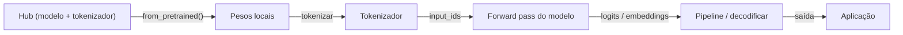
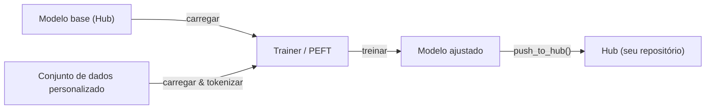

## Definição

Hugging Face é a plataforma central de código aberto para aprendizado de máquina: hospeda o **Hub** (mais de 500.000 modelos públicos e 50.000 conjuntos de dados), fornece a biblioteca `transformers` para carregar e executar modelos pré-treinados, e oferece ferramentas para [fine-tuning](/docs/llms/fine-tuning), avaliação e implantação. Abrange modelos de [NLP](/docs/nlp), visão computacional, fala e [multimodais](/docs/multimodal-ai) via uma API unificada, tornando prático a troca entre tarefas e arquiteturas sem aprender novas interfaces.

A biblioteca `transformers` funciona no [PyTorch](/docs/frameworks/pytorch), TensorFlow e JAX. Uma chamada `from_pretrained("nome-do-modelo")` baixa automaticamente pesos do modelo, tokenizadores e configuração do Hub. A mesma abstração funciona para [BERT](/docs/transformers/bert), decodificadores estilo [GPT](/docs/transformers/gpt), modelos de difusão, vision transformers e modelos de fala da classe whisper. `datasets` fornece carregamento e pré-processamento eficientes em streaming de grandes conjuntos de dados, e `accelerate` adiciona treinamento distribuído e de precisão mista com alterações mínimas de código.

Hugging Face também se integra ao ecossistema de IA mais amplo: modelos hospedados no Hub podem ser usados diretamente no [LangChain](/docs/tools/langchain) e [LlamaIndex](/docs/tools/llamaindex) como backends de inferência, e a biblioteca `peft` permite [fine-tuning](/docs/llms/fine-tuning) eficiente em parâmetros (LoRA, QLoRA) para que [LLMs](/docs/llms) possam ser adaptados com hardware consumidor. Spaces fornece hospedagem de demos sem configuração usando Gradio ou Streamlit, fazendo a ponte entre pesquisa e acesso público.

## Funcionamento

### Carregamento e inferência



### Fluxo de fine-tuning



### Bibliotecas principais

**`transformers`** — carregamento de modelos, inferência, tokenização. **`datasets`** — carregamento e pré-processamento eficiente de dados. **`accelerate`** — treinamento distribuído e precisão mista. **`peft`** — fine-tuning eficiente em parâmetros LoRA e QLoRA. **`evaluate`** — métricas (BLEU, ROUGE, precisão). **`diffusers`** — pipelines de modelos de difusão.

## Quando usar / Quando NÃO usar

| Cenário | Usar Hugging Face | NÃO usar Hugging Face |
|---------|-----------------|----------------------|
| Carregar e executar um modelo NLP ou visão pré-treinado | Sim — `from_pretrained` fornece API unificada | |
| Fine-tuning de um LLM em um conjunto de dados personalizado | Sim — Trainer + PEFT (LoRA/QLoRA) | |
| Compartilhar modelos e conjuntos de dados com a comunidade | Sim — Hub com fichas de modelo e versionamento | |
| Serviço de produção de alto throughput | | Usar vLLM, TGI ou TorchServe para inferência otimizada |
| Implantação edge em tempo real | | TFLite ou ONNX Runtime são mais adequados |
| Treinamento do zero de um grande modelo proprietário | | Ferramentas de fornecedores cloud (pods TPU, SLURM) podem ser preferidas |

## Vantagens e desvantagens

| Vantagens | Desvantagens |
|---------|------------|
| API unificada para centenas de arquiteturas | Grande footprint de dependências para casos simples |
| O Hub fornece fichas de modelo, versionamento e descoberta | Alguns modelos são de qualidade de pesquisa com suporte limitado |
| PEFT permite fine-tuning com hardware limitado | Throughput de inferência não é otimizado vs servidores especializados |
| Comunidade ativa e atualizações frequentes | Mudanças frequentes de API podem quebrar código existente |

## Exemplos de código

```python
# Load a pretrained text-classification model and run inference
from transformers import pipeline

classifier = pipeline("sentiment-analysis", model="distilbert-base-uncased-finetuned-sst-2-english")
result = classifier("Hugging Face makes NLP accessible to everyone.")
print(result)  # [{'label': 'POSITIVE', 'score': 0.9998}]

# Fine-tune with PEFT (LoRA) on a custom dataset
from transformers import AutoModelForCausalLM, AutoTokenizer, TrainingArguments, Trainer
from peft import get_peft_model, LoraConfig, TaskType
import datasets

model_name = "meta-llama/Llama-3.2-1B"
tokenizer = AutoTokenizer.from_pretrained(model_name)
base_model = AutoModelForCausalLM.from_pretrained(model_name)

lora_config = LoraConfig(task_type=TaskType.CAUSAL_LM, r=8, lora_alpha=32)
model = get_peft_model(base_model, lora_config)
model.print_trainable_parameters()  # shows only ~0.1% of params are trainable
```

## Comparações

| Funcionalidade | Hugging Face Transformers | API direta (OpenAI, Anthropic) |
|---------|--------------------------|-------------------------------|
| Acesso a modelos | Modelos open-source do Hub | Modelos frontier proprietários |
| Custo | Gratuito para executar (você paga pelo hardware) | Custo de API por token |
| Controle | Acesso completo a pesos e parâmetros internos | Caixa preta, controle limitado |
| Fine-tuning | Primeira classe (Trainer, PEFT) | Limitado (API de fine-tune da OpenAI) |
| Implantação | Auto-gerenciado (vLLM, TGI, TFLite) | Gerenciado pelo fornecedor |
| Melhor para | Pesquisa, fine-tuning personalizado, privacidade | Integração de produção rápida |

## Recursos práticos

- [Documentação do Hugging Face](https://huggingface.co/docs) — Docs completas da plataforma incluindo Hub, Transformers e Spaces
- [Biblioteca Transformers](https://huggingface.co/docs/transformers) — Referência de API, pipelines e fichas de modelos
- [Curso NLP do Hugging Face](https://huggingface.co/learn/nlp-course/) — Curso gratuito de ponta a ponta cobrindo Transformers e fine-tuning
- [Documentação PEFT](https://huggingface.co/docs/peft) — LoRA, QLoRA e outros métodos eficientes em parâmetros
- [Hub do Hugging Face](https://huggingface.co/models) — Navegar e filtrar mais de 500k modelos por tarefa, idioma e licença

## Veja também

- [Transformers](/docs/transformers)
- [LLMs](/docs/llms)
- [Fine-tuning](/docs/llms/fine-tuning)
- [RAG](/docs/rag)
- [Frameworks](/docs/frameworks/pytorch)
