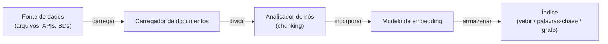

## Definição

LlamaIndex (anteriormente GPT Index) é um framework de dados que conecta [grandes modelos de linguagem](/docs/llms) às suas próprias fontes de dados. Seu foco principal é ingestão, indexação e consulta de documentos, bancos de dados e APIs para que LLMs possam responder perguntas ancoradas em informações privadas ou específicas de domínio. Ele fornece um alto grau de controle sobre cada etapa da [geração aumentada por recuperação](/docs/rag): carregamento de dados, análise de nós (chunking), seleção de embeddings, construção de índice, estratégia de recuperação, reranking e síntese de respostas.

Onde o [LangChain](/docs/tools/langchain) enfatiza orquestração composável e loops de agentes, o LlamaIndex é otimizado para a **camada de dados**: você pode trocar estratégias de chunking, algoritmos de recuperação e abordagens de síntese sem reconstruir o pipeline. Ele vem com motores de consulta, motores de chat e decomposição de subperguntas prontos para uso. Vários tipos de índice (vetor, resumo, grafo de conhecimento, palavras-chave) podem ser combinados em uma única consulta para recuperação híbrida.

O LlamaIndex também suporta [agentes](/docs/agents): motores de consulta podem ser registrados como ferramentas, e loops de raciocínio de agentes (ReAct, chamada de função OpenAI) podem selecionar qual motor consultar. Um conjunto de avaliação (fidelidade, relevância, precisão de contexto) ajuda a diagnosticar a qualidade do RAG e orienta o ajuste de chunking ou recuperação para produção.

## Funcionamento

### Pipeline de ingestão



### Pipeline de consulta


### Abstrações principais

**Nós** são a unidade de recuperação — pedaços de um documento com metadados. O **índice** armazena nós e suporta busca baseada em vetor, palavras-chave ou grafo. O **motor de consulta** envolve índice + recuperador + sintetizador em um único callable. O **motor de chat** mantém histórico de conversa. O **motor de subperguntas** decompõe consultas complexas em consultas mais simples distribuídas por múltiplos índices.

## Quando usar / Quando NÃO usar

| Cenário | Usar LlamaIndex | NÃO usar LlamaIndex |
|---------|---------------|---------------------|
| RAG em grandes corpora de documentos com controle de chunking | Sim — analisadores de nós finos e múltiplos tipos de índice | |
| Conectar LLMs a bancos de dados e APIs internas | Sim — conectores de dados para SQL, Notion, Slack, S3, etc. | |
| Avaliação de fidelidade e relevância de recuperação | Sim — módulos de avaliação integrados | |
| Fluxos de trabalho de agentes em múltiplas etapas chamando muitas APIs externas | | Prefira [LangChain](/docs/tools/langchain) para ferramentas de agentes mais ricas |
| Completações simples de uma rodada sem recuperação | | O overhead é desnecessário; chame a API LLM diretamente |
| Pipeline de produção precisando de rastreamento LangSmith | | Integrar com LangChain ou usar uma ferramenta de rastreamento dedicada |

## Comparações

| Funcionalidade | LlamaIndex | LangChain |
|---------|------------|-----------|
| Foco principal | Indexação e recuperação de dados (RAG) | Orquestração, cadeias, agentes |
| Controle de chunking | Analisadores de nós finos | Separadores de texto de alto nível |
| Tipos de índice | Vetor, palavras-chave, grafo, resumo, híbrido | Principalmente vetor via recuperadores |
| Avaliação | Integrada (fidelidade, relevância) | Via LangSmith |
| Suporte a agentes | Motores de consulta como ferramentas, ReAct | Agente LCEL de primeira classe |
| Melhor para | RAG profundo em grandes corpora | Orquestração de agentes em múltiplas etapas |

## Vantagens e desvantagens

| Vantagens | Desvantagens |
|---------|------------|
| Controle fino sobre cada etapa RAG | Curva de aprendizado mais íngreme do que wrappers LLM simples |
| Múltiplos tipos de índice incluindo grafos de conhecimento | Menos integrações não-RAG comparado ao LangChain |
| Conjunto de avaliação integrado para RAG em produção | Algumas abstrações adicionam verbosidade |
| Pipelines composáveis que trocam componentes facilmente | A documentação pode atrasar em relação aos lançamentos rápidos |

## Exemplos de código

```python
# Simple RAG pipeline with LlamaIndex
from llama_index.core import VectorStoreIndex, SimpleDirectoryReader
from llama_index.llms.openai import OpenAI
from llama_index.core import Settings

# Configure LLM and embedding model
Settings.llm = OpenAI(model="gpt-4o-mini")

# 1. Load documents from a directory
documents = SimpleDirectoryReader("./data").load_data()

# 2. Build a vector index (embeds and stores nodes automatically)
index = VectorStoreIndex.from_documents(documents)

# 3. Create a query engine with top-k retrieval
query_engine = index.as_query_engine(similarity_top_k=3)

# 4. Query
response = query_engine.query("What are the main topics covered?")
print(response)
```

## Dicas para uso eficaz

- Escolha o tamanho do chunk com base nos seus documentos: 256–512 tokens funciona bem para Q&A factual; 1024+ para tarefas de resumo.
- Use um reranker (por ex. `SentenceTransformerRerank`) para melhorar a precisão de recuperação sem mudar o índice.
- Combine um índice vetorial para busca semântica com um índice de palavras-chave para recuperação por correspondência exata usando um `QueryFusionRetriever`.
- Execute o conjunto de avaliação integrado periodicamente durante o desenvolvimento para detectar regressões na qualidade de recuperação.
- Use `IngestionPipeline` com um `RedisDocumentStore` para ingestão incremental para que documentos não sejam re-incorporados na reexecução.

## Recursos práticos

- [Documentação do LlamaIndex](https://docs.llamaindex.ai/) — Guias completos, referência de API e tutoriais
- [LlamaIndex — Guia RAG](https://docs.llamaindex.ai/en/stable/module_guides/deploying/rag/) — Pipelines de ingestão, indexação e consulta
- [LlamaIndex — Agentes](https://docs.llamaindex.ai/en/stable/module_guides/deploying/agents/) — Construir agentes com motores de consulta como ferramentas
- [LlamaIndex — Avaliação](https://docs.llamaindex.ai/en/stable/module_guides/evaluating/) — Métricas de fidelidade, relevância e precisão de contexto
- [LlamaHub](https://llamahub.ai/) — Conectores de dados, ferramentas e integrações da comunidade

## Veja também

- [RAG](/docs/rag)
- [LangChain](/docs/tools/langchain)
- [Bancos de dados vetoriais](/docs/rag/vector-databases)
