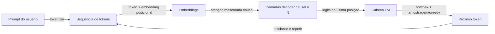

## Definição

GPT denota modelos transformer somente-decoder treinados para prever o próximo token (autorregressivo). Escalar esses modelos levou aos grandes modelos de linguagem (LLM) atuais capazes de tarefas few-shot e zero-shot.

O design somente-decoder é bem adequado para **geração**: a cada passo o modelo condiciona em tokens anteriores e prevê o próximo. Os [LLMs](/docs/llms) construídos sobre essa ideia são então fine-tunados por instruções e alinhados (por ex. RLHF) para chat e uso de ferramentas. Para tarefas somente de compreensão, encoders estilo [BERT](/docs/transformers/bert) podem ser mais eficientes em parâmetros.

A linha de modelos GPT (GPT-1, GPT-2, GPT-3, GPT-4) demonstrou que escalar um objetivo simples de previsão do próximo token em corpora cada vez maiores produz modelos com capacidades emergentes: raciocínio, geração de código, aritmética em múltiplas etapas e resolução de tarefas few-shot sem nenhum treinamento específico para a tarefa. As etapas de fine-tuning de instruções e RLHF que seguem o pré-treinamento base transformam um preditor de próximo token bruto em um assistente que segue de forma confiável instruções em linguagem natural, mantém contexto de conversa e recusa solicitações prejudiciais. Implantações modernas da família GPT são acessíveis via APIs e suportam funcionalidades como chamadas de funções, entradas visuais e streaming.

## Funcionamento



### Mascaramento causal

Os **tokens** são incorporados e alimentados nas **camadas de decoder causal**: cada posição só pode se concentrar em si mesma e em posições anteriores (auto-atenção mascarada via máscara triangular superior). Isso impede que o modelo "veja" o futuro durante treinamento e inferência.

### Cabeça de modelagem de linguagem

O **próximo token** é previsto a partir da representação da última posição via uma camada linear sobre o vocabulário, seguida de softmax. O **treinamento** maximiza a log-verossimilhança do próximo token dado todos os tokens anteriores (teacher forcing). A perda é calculada em média sobre todas as posições, então cada token na sequência contribui um sinal de gradiente.

### Inferência e amostragem

A **inferência** gera de forma autorregressiva: amostrar ou escolher guloso o próximo token, adicioná-lo e repetir até uma condição de parada (token EOS ou comprimento máximo). Parâmetros de amostragem (temperatura, top-k, top-p) controlam diversidade vs. determinismo. A [engenharia de prompts](/docs/prompt-engineering) e o [fine-tuning](/docs/llms/fine-tuning) moldam o comportamento da tarefa sobre esse mecanismo.

## Quando usar / Quando NÃO usar

| Cenário | Usar estilo GPT? | Notas |
|---------|-----------------|-------|
| Geração de texto, resumo, diálogo | Sim | Ajuste natural para geração autorregressiva |
| Classificação few-shot via prompting | Sim | GPT lida bem com isso com alguns exemplos |
| Busca semântica / recuperação densa | Com cautela | Bi-encoders (estilo BERT) são mais eficientes |
| Classificação NER ou no nível do token | Com cautela | Modelos encoder são mais eficientes em parâmetros |
| Raciocínio de contexto longo (\>8K tokens) | Sim | Modelos GPT modernos suportam contextos muito longos |
| Orçamento restrito / implantação edge | Não | Modelos GPT são grandes; usar alternativas destiladas |

## Comparações

| Aspecto | GPT (somente decoder) | BERT (somente encoder) |
|---------|----------------------|----------------------|
| Direção do contexto | Unidirecional (causal) | Bidirecional |
| Força principal | Geração | Compreensão / classificação |
| Objetivo de pré-treinamento | Previsão do próximo token | MLM mascarado + NSP |
| Capacidade zero-shot | Alta | Baixa |
| Qualidade de embedding (recuperação) | Moderada sem fine-tuning | Excelente (bi-encoder) |
| Acesso via API | OpenAI, Anthropic, Mistral, etc. | HuggingFace Hub |

## Vantagens e desvantagens

| Vantagens | Desvantagens |
|---------|------------|
| Forte geração zero-shot e few-shot | Caro para executar (grande número de parâmetros) |
| Modelo unificado para tarefas diversas | Propenso a alucinações |
| Seguimento de instruções via prompts | Sem contexto bidirecional explícito |
| Facilmente extensível com ferramentas e RAG | A saída deve ser validada / fundamentada |

## Exemplos de código

```python
# Chat completion with OpenAI API + streaming
from openai import OpenAI

client = OpenAI()  # reads OPENAI_API_KEY from environment

response = client.chat.completions.create(
    model="gpt-4o-mini",
    messages=[
        {"role": "system", "content": "You are a concise technical assistant."},
        {"role": "user",   "content": "Explain the difference between GPT and BERT in two sentences."},
    ],
    temperature=0.3,
    max_tokens=200,
    stream=True,
)

print("Response: ", end="", flush=True)
for chunk in response:
    delta = chunk.choices[0].delta
    if delta.content:
        print(delta.content, end="", flush=True)
print()  # newline at end
```

## Recursos práticos

- [Melhorando a compreensão de linguagem por pré-treinamento generativo (OpenAI)](https://cdn.openai.com/research-covers/language-unsupervised/language_understanding_paper.pdf) — Artigo original do GPT-1
- [Hugging Face – GPT-2](https://huggingface.co/docs/transformers/model_doc/gpt2) — Documentação do modelo e pesos hospedados
- [Referência API da OpenAI](https://platform.openai.com/docs/api-reference/chat) — Referência completa para o endpoint de completações de chat

## Veja também

- [Transformers](/docs/transformers)
- [LLMs](/docs/llms)
- [Engenharia de Prompts](/docs/prompt-engineering)
