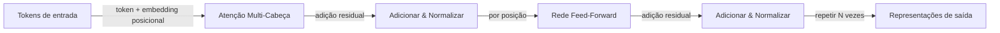

## Definição

Transformers são arquiteturas neurais baseadas em **auto-atenção**: cada token se concentra em todos os outros para calcular representações contextuais. Eles evitam a recorrência e permitem paralelização, escalando para sequências muito longas e modelos grandes (BERT, GPT, etc.).

Eles fundamentam os [LLMs](/docs/llms) modernos e foram estendidos para modelos [multimodais](/docs/multimodal-ai) e de [visão](/docs/cv). As variantes somente-encoder ([BERT](/docs/transformers/bert)) e somente-decoder ([GPT](/docs/transformers/gpt)) são as mais comuns hoje; o layout encoder-decoder continua sendo usado para tarefas de sequência para sequência.

O artigo "Attention Is All You Need" (2017) introduziu o transformer removendo completamente o loop recorrente e substituindo-o por atenção de produto escalar escalonada. Isso tornou o treinamento totalmente paralelizável, permitindo treinar modelos em conjuntos de dados muito maiores do que os predecessores baseados em RNN. Codificações posicionais substituem a ordenação implícita da recorrência; conexões residuais e normalização de camada estabilizam o fluxo de gradiente em muitas camadas. Essas escolhas de design, combinadas com a subcamada feed-forward para computação por posição, formam o bloco de construção fundamental que escalou para centenas de bilhões de parâmetros.

## Funcionamento



### Mecanismo de auto-atenção

**Atenção:** A entrada é projetada em matrizes Query (Q), Key (K) e Value (V). Os pesos de atenção são calculados como softmax(QK^T / sqrt(d_k)), então aplicados a V. A saída de cada token é uma combinação ponderada dos valores de todos os tokens — capturando o contexto global em uma única etapa.

### Atenção multi-cabeça

**Atenção multi-cabeça:** Múltiplas cabeças de atenção funcionam em paralelo, cada uma aprendendo diferentes padrões relacionais (sintaxe, co-referência, semântica). Suas saídas são concatenadas e projetadas, dando ao modelo uma capacidade representacional mais rica do que uma única cabeça de atenção.

### Encoder vs. decoder

**Somente encoder (ex. BERT):** Todos os tokens se concentram em todos os outros (bidirecional). Melhor para tarefas de compreensão. **Somente decoder (ex. GPT):** O mascaramento causal garante que cada posição só se concentre em tokens passados, permitindo geração autorregressiva. **Encoder-decoder:** Usado para tarefas como tradução onde a sequência de entrada é totalmente codificada antes de decodificar a saída.

## Quando usar / Quando NÃO usar

| Cenário | Usar transformers? | Notas |
|---------|------------------|-------|
| Classificação NLP, NER, QA | Sim | Somente encoder (estilo BERT) é o padrão |
| Geração de texto, chat, código | Sim | Somente decoder (estilo GPT) é o padrão |
| Inferência edge com poucos recursos | Com cautela | Variantes destiladas ou quantizadas são recomendadas |
| Sequências curtas com localidade clara | Com cautela | CNNs ou RNNs podem ser mais eficientes |
| Sequência para sequência (tradução) | Sim | Transformers encoder-decoder se destacam aqui |
| Tarefas de visão | Sim | Patches Vision Transformer (ViT) funcionam bem |

## Comparações

| Aspecto | RNN / LSTM | CNN | Transformer |
|---------|-----------|-----|-------------|
| Dependências de longo alcance | Moderadas | Baixas | Excelentes |
| Treinamento paralelizável | Não | Sim | Sim |
| Janela de contexto | Limitada pelo desenrolamento | Campo receptivo fixo | Configurável (até 1M+ tokens) |
| Custo de memória na inferência | Baixo (estado fixo) | Baixo | Alto (cache KV cresce com o contexto) |
| NLP state-of-the-art | Não | Não | Sim |

## Vantagens e desvantagens

| Vantagens | Desvantagens |
|---------|------------|
| Paralelizável, escalável | Computação e memória altas |
| Forte em dependências de longo alcance | Requer grandes dados |
| Arquitetura unificada para muitas tarefas | Desafios de interpretabilidade |
| Modelos pré-treinados amplamente disponíveis | Custo de atenção quadrático com o comprimento da sequência |

## Exemplos de código

```python
# Self-attention from scratch with PyTorch
import torch
import torch.nn as nn
import torch.nn.functional as F
import math

class MultiHeadSelfAttention(nn.Module):
    def __init__(self, d_model: int, num_heads: int):
        super().__init__()
        assert d_model % num_heads == 0
        self.d_k = d_model // num_heads
        self.num_heads = num_heads
        self.W_qkv = nn.Linear(d_model, 3 * d_model, bias=False)
        self.W_o   = nn.Linear(d_model, d_model, bias=False)

    def forward(self, x: torch.Tensor, causal: bool = False) -> torch.Tensor:
        B, T, C = x.shape
        qkv = self.W_qkv(x).split(C, dim=2)
        q, k, v = [t.view(B, T, self.num_heads, self.d_k).transpose(1, 2) for t in qkv]
        scale  = math.sqrt(self.d_k)
        scores = (q @ k.transpose(-2, -1)) / scale         # (B, heads, T, T)
        if causal:
            mask = torch.tril(torch.ones(T, T, device=x.device)).bool()
            scores = scores.masked_fill(~mask, float('-inf'))
        weights = F.softmax(scores, dim=-1)
        out = (weights @ v).transpose(1, 2).contiguous().view(B, T, C)
        return self.W_o(out)

# Test with a dummy batch
attn  = MultiHeadSelfAttention(d_model=64, num_heads=4)
x     = torch.randn(2, 10, 64)   # batch=2, seq_len=10, d_model=64
print(attn(x).shape)             # (2, 10, 64)
```

## Recursos práticos

- [Attention Is All You Need (Vaswani et al.)](https://arxiv.org/abs/1706.03762) — Artigo original do transformer
- [Hugging Face – Resumo de modelos](https://huggingface.co/docs/transformers/model_summary) — Visão geral das famílias de modelos transformer
- [O Transformer Ilustrado](https://jalammar.github.io/illustrated-transformer/) — Melhor explicação visual da arquitetura

## Veja também

- [BERT](/docs/transformers/bert)
- [GPT](/docs/transformers/gpt)
- [LLMs](/docs/llms)
