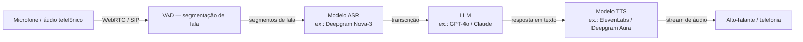

## Definição

Um **agente de voz** é um sistema de IA que aceita áudio falado como entrada, raciocina com um modelo de linguagem e retorna fala sintetizada como saída — tudo com latência baixa o suficiente para sustentar uma conversa natural. Diferente dos chatbots de texto, agentes de voz precisam lidar com ruído acústico, interrupções do usuário e um orçamento de latência rigoroso: dados de pesquisa e da indústria mostram consistentemente que latência de ida e volta acima de 600 ms parece lenta, e acima de 1,5 s os usuários abandonam a interação completamente.

A arquitetura de produção dominante em 2026 continua sendo o **pipeline em cascata**: um modelo dedicado de Reconhecimento Automático de Fala (ASR) converte áudio em texto, um LLM raciocina e gera uma resposta, e um modelo de Text-to-Speech (TTS) sintetiza a resposta falada. Essa separação é popular porque cada estágio pode ser substituído ou atualizado de forma independente, e a representação de texto intermediária é fácil de registrar e depurar. Uma alternativa emergente — **modelos speech-to-speech** (ex.: GPT-4o Audio, Gemini Live) — funde os três estágios em uma única rede neural, trocando transparência de componentes por menor latência em turnos simples.

Principais componentes abordados nesta seção:

- O **[pipeline em cascata STT → LLM → TTS](/docs/voice-agents/stt-llm-tts-pipeline)** — seleção de componentes, decomposição de latência e detecção de atividade de voz.
- **[Áudio em tempo real](/docs/voice-agents/realtime-audio)** — transporte WebRTC, tratamento de barge-in/interrupção e plataformas gerenciadas (LiveKit, Vapi, Deepgram).

## Como funciona

**VAD (Detecção de Atividade de Voz):** detecta segmentos de fala e aciona o estágio de STT; também detecta barge-in (usuário falando enquanto o agente fala) para interromper a reprodução. **STT:** converte segmentos de áudio em texto em tempo real; modelos de última geração (Deepgram Nova-3, Whisper v3) alcançam latência fim a fim inferior a 300 ms. **LLM:** gera a resposta, opcionalmente chamando ferramentas ou consultando RAG; a saída de tokens em streaming permite que o TTS comece antes que a resposta completa esteja pronta. **TTS:** converte tokens de texto em áudio conforme chegam, permitindo que a reprodução comece dentro de aproximadamente 75 ms do primeiro token.

## Quando usar / Quando NÃO usar

| Cenário | Usar agentes de voz | Evitar agentes de voz |
|---|---|---|
| Suporte ao cliente / substituição de IVR que necessita conversa natural | Sim — menor fricção do que menus DTMF | Não — DTMF/somente texto funciona para seleção simples de menu |
| Acessibilidade (deficientes visuais, cenários mãos-livres) | Sim — voz é a modalidade principal | Não — se tela e teclado estão disponíveis e são preferidos |
| Raciocínio complexo em múltiplos passos com chamadas de ferramentas | Sim — com TTS em streaming para ocultar latência do LLM | Não — se SLA de latência &lt; 300 ms; considere speech-to-speech |
| Ambientes barulhentos (chão de fábrica, ambientes externos) | Com ASR robusto a ruído (Deepgram, Whisper) | Evitar sem pré-processamento acústico |
| Telefonia em alto volume (call centers) | Sim — LiveKit/Vapi suportam SIP/PSTN nativamente | Não — se o custo por minuto é proibitivo em escala |
| Implantação global multilíngue | Sim — Deepgram Nova-3 suporta 36 idiomas | Verificar qualidade do TTS por idioma antes do lançamento |

## Métricas-chave

| Métrica | Limite | Notas |
|---|---|---|
| Latência total de ida e volta | &lt; 600 ms ideal, &lt; 300 ms excelente | STT + primeiro token LLM + primeiro áudio TTS |
| Taxa de Erro de Palavras (WER) | &lt; 10% | Deepgram Nova-3: 6,84% WER (2025) |
| Tempo para primeiro áudio (TTFA) | &lt; 200 ms | TTS em streaming é crítico para TTFA baixo |
| Taxa de detecção de barge-in | > 95% | Interrupções perdidas prejudicam muito a UX |

## Fontes

- [LiveKit – Voice agent architecture: STT, LLM, and TTS pipelines explained](https://livekit.com/blog/voice-agent-architecture-stt-llm-tts-pipelines-explained)
- [LiveKit Agents GitHub — open-source real-time agent framework](https://github.com/livekit/agents)
- [Deepgram – Nova-3 ASR model overview](https://deepgram.com/learn/nova-3-speech-to-text-model)
- [Voice AI pipeline: STT, LLM, TTS and the 300 ms budget — Chanl Blog](https://www.channel.tel/blog/voice-ai-pipeline-stt-tts-latency-budget)
- [Best voice agent stack: a complete selection framework — Hamming AI](https://hamming.ai/resources/best-voice-agent-stack)

## Veja também

- [Pipeline STT-LLM-TTS](/docs/voice-agents/stt-llm-tts-pipeline)
- [Áudio em tempo real](/docs/voice-agents/realtime-audio)
- [Reconhecimento de fala](/docs/speech-recognition)
- [Agentes de IA](/docs/agents)
- [LLMs](/docs/llms)
