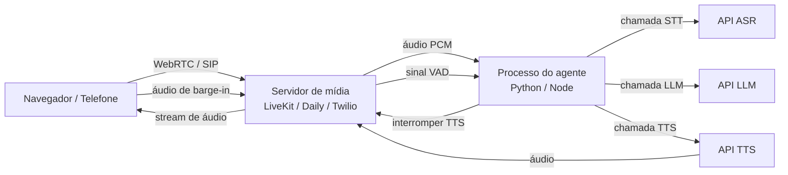

## Definição

**Áudio em tempo real** em agentes de voz refere-se ao desafio de pilha completa de entregar fala interativa sub-segundo pela rede: escolher o protocolo de transporte correto, tratar interrupções do usuário de forma elegante e decidir entre uma pilha auto-hospedada ou uma plataforma gerenciada. Enquanto o [pipeline STT-LLM-TTS](/docs/voice-agents/stt-llm-tts-pipeline) define o que acontece com o áudio, a infraestrutura de áudio em tempo real define *como* o áudio trafega entre o dispositivo do usuário e o agente, e como o sistema reage quando o usuário fala no meio de uma resposta.

## Como funciona

### Transporte WebRTC

WebRTC (Web Real-Time Communication) é o transporte padrão de facto para agentes de voz baseados em navegador. Ele fornece mídia UDP criptografada peer-to-peer ou via relay de servidor, com buffering de jitter integrado, retransmissão NACK e bitrate adaptativo. O codec Opus (6–510 kbps) é universalmente suportado e otimizado para fala.

Para implantações em telefonia (call centers, IVR), trunks SIP/PSTN são usados; plataformas como Vapi fornecem integração SIP nativa que abstrai as diferenças de protocolo da lógica do agente.

### Barge-in e tratamento de interrupções

Barge-in ocorre quando o usuário começa a falar enquanto o áudio TTS do agente está sendo reproduzido. Tratar isso corretamente é crítico para a naturalidade da conversa:

1. **Detecção** — VAD roda continuamente no canal de áudio do usuário mesmo durante a reprodução do TTS.
2. **Sinal** — quando o VAD detecta fala sustentada (tipicamente > 200 ms), dispara um evento de interrupção.
3. **Cancelar TTS** — o agente para de enviar chunks de áudio e drena o buffer de reprodução.
4. **Abortar LLM** (opcional) — se o LLM ainda está gerando, o stream é cancelado para evitar tokens desperdiçados.
5. **Retomar pipeline** — o novo segmento de fala do usuário entra normalmente no estágio STT.

LiveKit Agents 1.5 (abril de 2026) inclui tratamento adaptativo de barge-in que ajusta o limiar de atividade de voz com base no nível de ruído de fundo, reduzindo falsos barge-ins em ambientes barulhentos.

### Comparativo de plataformas gerenciadas

| Plataforma | Transporte | Barge-in | SIP/PSTN | Código aberto | Modelo de preço |
|---|---|---|---|---|---|
| **LiveKit** | WebRTC nativo | Adaptativo (v1.5) | Via SIP trunk | Sim (Apache 2.0) | Gratuito + a partir de $50/mês |
| **Vapi** | WebRTC + SIP | Integrado | Nativo | Não | $0,05/min + componentes |
| **Deepgram** | WebSocket / API | Via streaming Nova-3 | Não | Não | Pago por minuto |
| **Daily** | WebRTC | Via VAD parceiro | Via trunk | Não | $0,004/min de mídia |
| **Twilio Voice** | SIP/PSTN | Via `<Gather>` | Nativo | Não | $0,013/min |

### LiveKit Agents (código aberto)

LiveKit é a principal escolha de código aberto para agentes de voz nativos em WebRTC. O SDK Python (v1.5, abril de 2026) expõe uma API de pipeline que conecta VAD → STT → LLM → TTS com streams assíncronos. Os recursos incluem suporte nativo ao Model Context Protocol (MCP), gerenciamento de participantes por sala e mixagem de áudio multi-faixa para cenários de conferência.

### Vapi (gerenciado)

Vapi é uma plataforma totalmente gerenciada com API REST/WebSocket. Os desenvolvedores especificam um modelo, uma voz e um prompt de sistema; o Vapi cuida da configuração da sessão WebRTC, STT, TTS e barge-in. Sua integração SIP/PSTN nativa o torna o caminho de menor fricção para agentes de voz acessíveis por número de telefone. O modelo de componentes modulares permite misturar provedores: por exemplo, Deepgram STT + GPT-4o + ElevenLabs TTS dentro da orquestração do Vapi.

## Quando usar / Quando NÃO usar

| Cenário | Usar | Evitar |
|---|---|---|
| UX de voz baseada em navegador | WebRTC (LiveKit, Daily) | SIP — WebRTC nativo do navegador é mais simples |
| Telefonia / substituição de IVR | Vapi ou Twilio SIP | WebRTC — telefones usam SIP/PSTN |
| Controle total de infraestrutura, auto-hospedado | LiveKit código aberto | Plataformas gerenciadas — adicionam dependência de fornecedor |
| Menor tempo para o mercado | API gerenciada Vapi | Auto-hospedagem — overhead operacional é significativo |
| Produção em alto volume (> 10 k min/mês) | LiveKit auto-hospedado ou LK Cloud | Vapi — preço por minuto supera custo de auto-hospedagem |
| Ambientes barulhentos | VAD adaptativo (LiveKit 1.5+) | VAD de limiar fixo causa frequentes falsos barge-ins |

## Fontes

- [LiveKit voice agents product page](https://livekit.com/voice-agents)
- [LiveKit Agents GitHub — open-source framework](https://github.com/livekit/agents)
- [Build and deploy LiveKit AI voice agents: the 2026 playbook — Forasoft](https://www.forasoft.com/blog/article/livekit-ai-agents-guide)
- [Voice AI chatbot platforms in 2026 — GetStream](https://getstream.io/blog/voice-chatbot-platforms/)
- [Best voice agent stack: a complete selection framework — Hamming AI](https://hamming.ai/resources/best-voice-agent-stack)

## Veja também

- [Agentes de voz](/docs/voice-agents)
- [Pipeline STT-LLM-TTS](/docs/voice-agents/stt-llm-tts-pipeline)
- [Reconhecimento de fala](/docs/speech-recognition)
- [Agentes de IA](/docs/agents)
