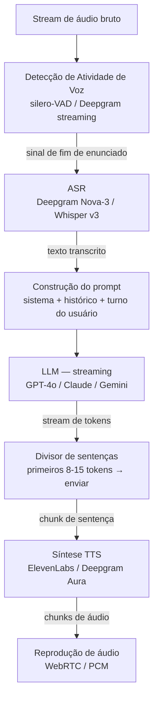

## Definição

O **pipeline em cascata STT → LLM → TTS** é a arquitetura padrão para agentes de voz em produção. Cada estágio é um modelo ou API separado: um sistema de Reconhecimento Automático de Fala (ASR) transcreve áudio em texto, um Modelo de Linguagem de Grande Escala gera uma resposta textual, e um sistema de Text-to-Speech sintetiza a fala. O encadeamento mantém cada componente substituível e observável de forma independente, ao custo de latência aditiva entre estágios.

A restrição central é um **orçamento de 300 ms**: em 300 ms ou menos de latência total de ida e volta, a conversa parece humana; de 300 a 600 ms parece aceitável mas ligeiramente robótica; acima de 600 ms os usuários se adaptam a um modelo mental de turnos mais parecido com walkie-talkies; acima de 1,5 s o abandono de chamadas aumenta acentuadamente. Transmitir tokens do LLM diretamente para o sistema TTS — para que a síntese de fala comece antes que a resposta completa seja gerada — é a maior alavanca para atingir esse orçamento.

## Como funciona

### Estágio 1 — Detecção de Atividade de Voz (VAD)

O VAD detecta segmentos de fala e dispara um evento de fim de enunciado (EOU) que aciona o STT. Um VAD rápido e preciso (silero-VAD, WebRTC VAD) previne EOU falso em pausas naturais, reduzindo transcrições truncadas. Em implantações em tempo real, o VAD também monitora o canal de reprodução para detectar barge-in (usuário falando enquanto o TTS reproduz) e aciona o tratamento de interrupção.

### Estágio 2 — Fala para Texto (ASR)

| Modelo | WER (en) | Latência | Idiomas | Notas |
|---|---|---|---|---|
| Deepgram Nova-3 | 6,84% | &lt; 300 ms | 36 | Streaming, robusto a ruído, maio 2025 |
| OpenAI Whisper v3 | ~8% | 300–800 ms | 99 | Orientado a batch; tempo real via endpoint de streaming |
| AssemblyAI Universal-2 | ~9% | &lt; 400 ms | 99 | Forte em fala com sotaque |
| Azure Cognitive Speech | ~9% | &lt; 300 ms | 100+ | SLA empresarial; vocabulário personalizado |

ASR em streaming (Deepgram, Azure) retorna **transcrições parciais** conforme o usuário fala; a transcrição final dispara no EOU. Transcrições parciais podem ser usadas para chamar o LLM especulativamente mais cedo, reduzindo 150–300 ms de latência percebida.

### Estágio 3 — Geração pelo LLM

O LLM recebe a transcrição do usuário injetada no prompt de conversa e transmite tokens de volta. Considerações-chave:

- **Streaming é obrigatório** — aguardar a resposta completa antes do TTS adiciona 350 ms–1 s+ de tempo morto silencioso.
- **Chamadas de ferramentas bloqueiam o TTS** — se uma chamada de ferramenta é disparada, reproduza uma frase de preenchimento ("Deixa eu verificar isso…") enquanto aguarda o resultado da ferramenta para evitar silêncio.
- **Gerenciamento de janela de contexto** — turnos de voz são curtos, mas conversas longas devem podar o histórico para manter-se dentro do orçamento; estratégias de janela deslizante ou sumarização se aplicam.

### Estágio 4 — Texto para Fala (TTS)

O TTS converte tokens de texto em áudio. O pipeline envia chunks de nível de sentença (8–15 tokens) assim que o LLM os emite, iniciando a reprodução dentro de aproximadamente 75 ms da primeira sentença concluída.

| Provedor | Latência (TTFA) | Vozes | Streaming | Notas |
|---|---|---|---|---|
| ElevenLabs | ~100 ms | 1.000+ | Sim | Melhor expressividade; custo maior |
| Deepgram Aura | ~75 ms | 10+ | Sim | Integrado com Nova-3; menor latência |
| OpenAI TTS-1 | ~250 ms | 6 | Sim | Confiável; expressividade moderada |
| Cartesia Sonic | ~90 ms | personalizado | Sim | Otimizado para tempo real; clonagem de voz |

## Quando usar / Quando NÃO usar

| Cenário | Pipeline em cascata | Ignorar cascata |
|---|---|---|
| Precisa trocar ASR ou TTS de forma independente | Sim — melhor flexibilidade | Não — speech-to-speech os funde |
| Registro completo de conversas necessário | Sim — texto em cada estágio | Não — speech-to-speech não tem texto intermediário |
| Menor latência possível em turnos simples | Competitivo com streaming | Modelos speech-to-speech (GPT-4o Audio) podem ser mais rápidos |
| Uso de ferramentas, RAG, raciocínio estruturado | Sim — LLM tem capacidades completas | Modelos speech-to-speech têm suporte limitado a chamadas de ferramentas |
| Idiomas não ingleses | Sim — seleção de modelo por idioma | Verificar qualidade do TTS — muitos modelos speech-to-speech são English-first |

## Decomposição prática de latência

| Estágio | Faixa típica | Faixa otimizada |
|---|---|---|
| Detecção de fim de enunciado pelo VAD | 50–150 ms | 30–80 ms |
| Transcrição ASR (streaming) | 100–500 ms | 80–200 ms |
| Tempo para primeiro token do LLM | 200–800 ms | 150–350 ms |
| Tempo para primeiro áudio do TTS | 75–250 ms | 60–100 ms |
| **Total (realista)** | **425 ms–1,7 s** | **320–730 ms** |

## Fontes

- [LiveKit – Sequential pipeline architecture for voice agents](https://livekit.com/blog/sequential-pipeline-architecture-voice-agents)
- [Voice AI pipeline: STT, LLM, TTS and the 300 ms budget — Chanl](https://www.channel.tel/blog/voice-ai-pipeline-stt-tts-latency-budget)
- [Deepgram Nova-3 model card](https://deepgram.com/learn/nova-3-speech-to-text-model)
- [Introl – Voice AI infrastructure: building real-time speech agents](https://introl.com/blog/voice-ai-infrastructure-real-time-speech-agents-asr-tts-guide-2025)

## Veja também

- [Agentes de voz](/docs/voice-agents)
- [Áudio em tempo real](/docs/voice-agents/realtime-audio)
- [Reconhecimento de fala](/docs/speech-recognition)
- [Streaming de LLMs](/docs/llms/streaming)
